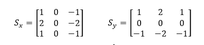
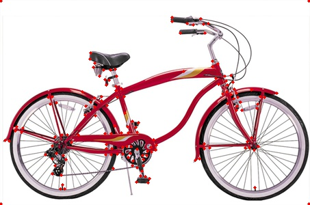
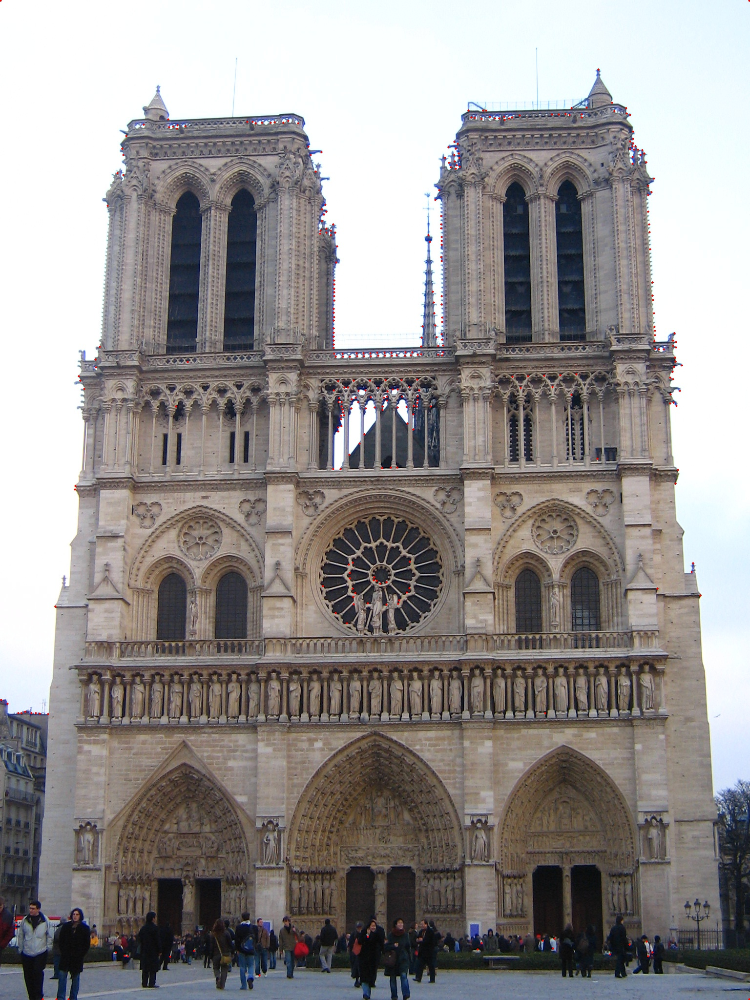

# Harris_Corner_Detector

Harris Corner Detection is used to recognize corner points in a given window. 

Harris Corner Detection has the following steps-

* Step1 : Take Gradients in X and Y direction in a given window.
* Step2 : For each window, R scored in calculated. 
* Step3 : After applying a threshold, important corners are selected.
* Step4 : Non-Max supression is applied to select and mark final set of points. 

First, Gray scale image is obtained. Then a Gaussian Filter is applied to the image to remove noise. Gaussian Filter of sigma=1 and mean=0 is used. Thereafter Gradients were calculated in X and Y direction. To compute the Gradients, Sobel Filter was used. Sobel Filters for X and Y direction are shown-

Gaussian Filter is also applied onto the Gradients. Afterwards, R value is calculated by creating M matrix for a 3x3 window. After applying threshold and Non Max suppression final list of corners or features are obtained. Some of the results are shown-

